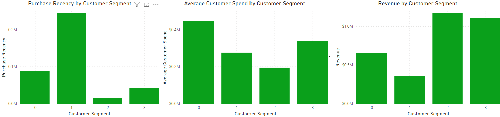

# **Customer RFM Segmentation Analysis**
## **Project Background**
This project utilizes data-driven segmentation to derive actionable insights for a mid-sized retail company specializing in lifestyle and home goods. We are analyzing a dataset of thousands of customer transactions during one year. Collaborating closely with the Marketing and Strategy teams, we determined it would be most productive to use customer segmentation and time series-based analysis to inform tailored strategies to enhance engagement, retention, and revenue growth.
## **Executive Summary**
This analysis identifies four customer segments using Recency, Frequency, and Moneary metrics. These segments include:
* Occasional recent buyers (Segment 0), with moderate spending and average frequency, offering upselling opportunities. 
* Inactive low-spenders (Segment 1) are the least engaged, requiring targeted win-back efforts. 
* High-value loyal customers (Segment 2) drive the most revenue but spend less per visit, suggesting potential for basket size growth.
* Recently active customers (Segment 3) show higher spending and moderate loyalty, ideal for deepening engagement.

The analysis also dove into seasonal trends in conjunction with these segments. Revealing a Winter peak in basket size and churn, suggesting targeted holiday promotions and retention efforts. Spring’s higher churn and lower basket sizes highlight the need for engagement campaigns, while Summer’s low churn offers opportunities to reward loyalty. 
These insights guide strategies to improve retention, re-engage inactive customers, and maximize revenue across segments and seasons.

## **Dataset Overview**
Source: UC Irvine Machine Learning Repository
**Original Dataset:**
* InvoiceNo: 6-digit number uniquely assigned to each transaction.
* StockCode: 5-digit number uniquely assigned to each distinct product.
* Description: Product name.
* Quantity: Quantity of each item per transaction.
* InvoiceDate: Day and time when each transaction was generated.
* UnitPrice: Product price per unit.
* CustomerID: a 5-digit number uniquely assigned to each customer.
* Country: Name of the country where each customer resides.

**Aggregated Dataset:**
* CustomerID: a 5-digit number uniquely assigned to each customer.
* Price: The total revenue per customer.
* Frequency: How many transactions were made per customer.
* Basket Size: The total number of items purchased per customer.
* Recency: How recently a customer made a purchase.
* Amount Spent per Visit: The average amount spent per visit.
* RMF Cluster: Customer segments organized by Price, Frequency, and Recency.

## **Insight Deep Dive**
### Customer Segmentation Based on RFM Clusters:
* Segment 1 (Inactive Low Spenders) has the highest Recency, meaning they have gone the longest without purchasing by a significant margin.
* On average, Segment 1 customers have gone nearly 25 times longer without visiting the store compared to Segment 2. Despite this, Segment 1's total revenue is only about one-third of Segment 2's.
* Segments 2 and 3 demonstrate the critical role of consistent, frequent customers in driving high revenue, and emphasize the importance of maintaining loyalty.
* While Segment 3's Recency is three times higher than Segment 2's, the revenue decline is not proportional, suggesting other factors mitigate the impact.

### Churn Rate Per Segment
* Churn Rate by Month
  * Churn Rate fluctuations month over month constantly changing
  * There is a larger spike in November compared to other months. And an overall average higher Churn during the Winter-Spring Season compared to Summer-Fall.
* Churn by Customer Segment
  * Cluster 1 represents the largest churn rate.

### Basket Size Per Segment
* Basket Size by Month
  * Basket Size had its highest peak in November and an overall highest Basket Size in the Fall-Winter
* Basket Size by Customer Segment
  * Basket Size is rather diverse and spread evenly amongst Customer Segments.
  * Basket Size for all segments are nearly identical. This indicates that all customer segments purchase similar amounts per visit.

## **Recommendations**
#### _Seasonal Recommendations:_
* Implement Winter engagement strategies by using targeted holiday promotions.
  * Rationale: Capitalize on large basket sizes during the season and encourage repeat purchases following the November Churn Rate spike.

* Post Winter engagement strategies by using Spring promotions.
  * Rationale: Early Spring promotions help reduce the average Spring Churn Rate to fall in line with Summer. Also, it increases the Basket Size deficit in Spring.

* Focus on rewarding existing customers during the Summer months with an emphasis on loyalty programs.
  * Rationale: Summer has the lowest Churn Rate averages, so we can use this period when engagement is already high to focus on maintaining loyal customers.

#### _Customer Segment Recommendations:_
**Segment 0:**
* This segment represents customers who have visited with a moderate frequency, and have an average spending amount per visit between loyal and one-time customers. This segment also has the highest Average Customer Spending.
* Represents 18% of total customers.

**Segment 1:**
* This segment of customers has not purchased for the longest time compared to other segments. They are also the most unlikely to be returning customers.
* Represents 22% of total customers.

**Segment 2:**
* This Segment of customers is our most loyal. They are the most likely to be repeat customers. They also make up the most revenue of all segments. However, the average amount spent per visit is the lowest of all segments. Despite having the largest Basket Size (number of items per order), their average spending per visit is the lowest among all segments.
* Represents 17% of total customers.

**Segment 3:**
* This segment represents customers who have made recent purchases. But are slightly less loyal than Segment 2. What differentiates the groups is that this segment has a higher average spending amount per order. In terms of total revenue, they still lag behind Segment 2 slightly.
* Represents 42% of total customers.

***Segmentation Recommendations:***
* Implement loyalty programs to drive purchase frequency. This loyalty program can reward consistent purchases through a point system.
  * Rationale: This will retain and potentially convert our high-value customers who purchase irregularly (Segments 0 & 3) into more loyal customers. This will also help in rewarding and maintaining our most loyal customer base (Segment 2). This could also incentivize our highest spenders to continue large purchases (Segments 0 & 3).
  * Upsell opportunities for the loyalty program include rewarding frequent customers. Such as complementary products or bundle deals to increase Basket Size and Average Spend for Segment 2 specifically.
* Utilize targeted marketing campaigns toward our infrequent customers. This win-back campaign could include personalized offers based on previous purchases, and general email reminders.
  * Rationale: A win-back campaign will not drive revenue by re-engaging our already loyal customers. We would likely see more benefits with targeted marketing by reeling back in our churned customers who are already spending moderately (Segment 1). This could also serve to retain our other irregular customers (Segment 0).

## **Assumptions, and Caveats**
* The shortcomings of using a Machine Learning dataset:
  * This dataset lacks a lot of complexities and randomness in real-world datasets. Patterns in these datasets, like Kaggle, are overly simplistic and usually completely uniform.
  * It will not contain outliers or general unexpected values that show real-world influences and factors.
  * It isn't easy to validate data without real-world context.
* Stockcode Records: Assumed that nonstandard Stockcodes are anomalies and were removed from the analysis.
* Deterministic Relationship: Basket Size and Churn Rate were directly inversed. The lack of variation should be examined to confirm any intended relationships.
